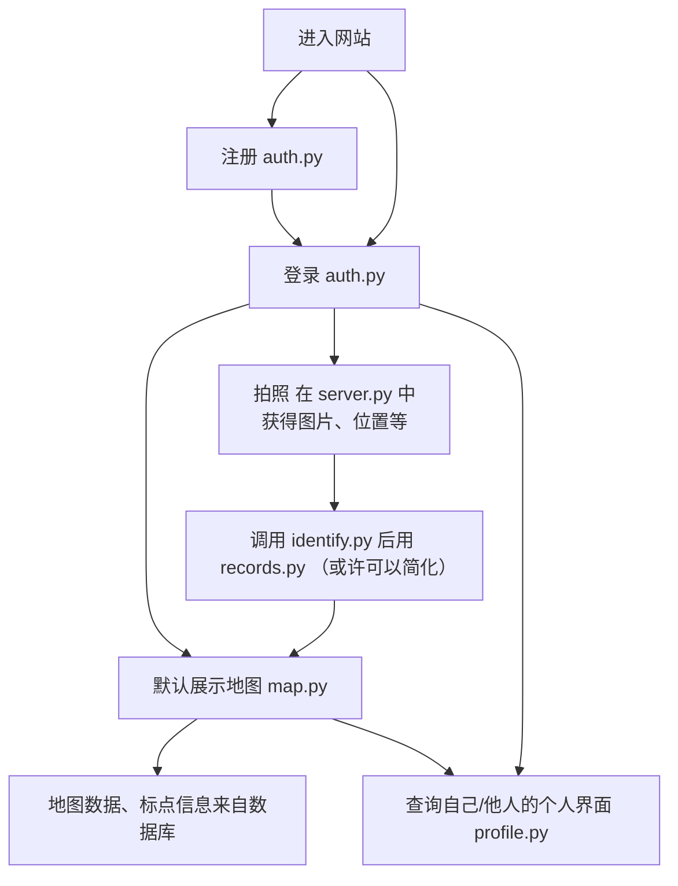

# 代码结构

## 目录树
```
Magic-Chirp/
├─ server.py                      # FastAPI 入口
├─ backend/
│  ├─ src/
│  │  ├─ __init__.py
│  │  ├─ modules/
│  │  │  ├─ auth.py               # 注册登录模块
│  │  │  ├─ profile.py            # 用户资料页面展示
│  │  │  ├─ records.py            # 观鸟记录相关数据上传到服务器
│  │  │  ├─ identify.py           # 识别接口
│  │  │  └─ map.py                # 地图展示
│  │  └─ config/                  # 环境配置（环境加载、配置文件等，如不需要也可以不用）
├─ frontend/
│  └─ 略
├─ database/
│  └─ databaseControl.py          # 数据库控制代码
└─ README.md
```

## 流程图
