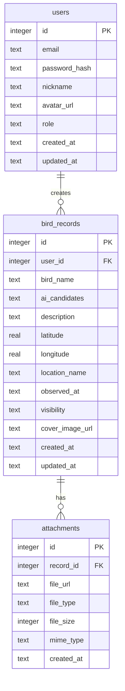

# Magic-Chirp 函数职责与数据库设计

本文档用于指导 4 人 2 周 MVP 的实际开发，说明每个文件建议包含哪些函数、这些函数依赖哪些模块，以及数据库表结构如何设计。

## 1. 总体依赖关系

```text
server.py
  └─ 挂载 modules 中的 router

modules/auth.py
  ├─ 依赖 schemas/user.py
  ├─ 依赖 database/databaseControl.py
  └─ 依赖 config/settings.py

modules/records.py
  ├─ 依赖 schemas/record.py
  ├─ 依赖 modules/auth.py
  ├─ 依赖 storage/files.py
  └─ 依赖 database/databaseControl.py

modules/identify.py
  ├─ 依赖 schemas/identify.py
  ├─ 依赖 storage/files.py，可选
  └─ 依赖 config/settings.py

modules/map_records.py
  ├─ 依赖 schemas/record.py
  └─ 依赖 database/databaseControl.py

database/databaseControl.py
  ├─ 依赖 database/models.py
  └─ 依赖 config/settings.py

storage/files.py
  └─ 依赖 config/settings.py
```

## 2. `server.py`

作用：FastAPI 应用入口。

建议包含：

| 函数 / 对象 | 作用 | 依赖 |
|---|---|---|
| `app = FastAPI(...)` | 创建 FastAPI 应用 | `fastapi.FastAPI` |
| `configure_cors(app)` | 配置跨域 | `CORSMiddleware` |
| `include_routers(app)` | 挂载业务路由 | `auth.router`、`records.router`、`identify.router`、`map_records.router` |
| `mount_static_files(app)` | 挂载 `/uploads` 静态目录 | `StaticFiles`、`settings.UPLOAD_DIR` |
| `startup_event()` | 启动时初始化数据库 | `databaseControl.init_db` |

建议结构：

```python
app = FastAPI(title="Magic-Chirp API")

configure_cors(app)
mount_static_files(app)
include_routers(app)

@app.on_event("startup")
def startup_event():
    init_db()
```

## 3. `backend/src/modules/auth.py`

作用：用户注册、登录、当前用户认证。

建议包含：

| 函数 / 对象 | 类型 | 作用 | 依赖 |
|---|---|---|---|
| `router` | APIRouter | 注册认证相关接口 | `fastapi.APIRouter` |
| `register_user(payload)` | 接口函数 | 注册用户 | `UserRegister`、`create_user`、`get_user_by_email` |
| `login_user(payload)` | 接口函数 | 登录并返回 token | `UserLogin`、`get_user_by_email`、`verify_password`、`create_access_token` |
| `get_me(current_user)` | 接口函数 | 返回当前登录用户 | `get_current_user` |
| `hash_password(password)` | 工具函数 | 生成密码哈希 | `passlib` 或 `hashlib` |
| `verify_password(password, password_hash)` | 工具函数 | 校验密码 | `passlib` 或 `hashlib` |
| `create_access_token(user_id)` | 工具函数 | 生成 JWT | `settings.JWT_SECRET` |
| `decode_access_token(token)` | 工具函数 | 解析 JWT | `settings.JWT_SECRET` |
| `get_current_user()` | 依赖函数 | 从请求头 token 获取当前用户 | `OAuth2PasswordBearer`、`decode_access_token`、`get_user_by_id` |
| `validate_nju_email(email)` | 工具函数 | 校验南大邮箱后缀 | `settings.ALLOWED_EMAIL_SUFFIX` |

核心依赖：

```text
auth.py
  -> schemas/user.py
  -> database/databaseControl.py
  -> config/settings.py
```

MVP 建议：

- 如果时间紧，注册可以先不做验证码。
- 登录必须做。
- `get_current_user()` 很重要，`records.py` 会依赖它判断谁在创建记录。

## 4. `backend/src/modules/records.py`

作用：观鸟记录的创建、查询、编辑、删除。

建议包含：

| 函数 / 对象 | 类型 | 作用 | 依赖 |
|---|---|---|---|
| `router` | APIRouter | 注册记录相关接口 | `fastapi.APIRouter` |
| `create_record(...)` | 接口函数 | 创建观鸟记录，可带图片 | `get_current_user`、`save_upload_file`、`databaseControl.create_record` |
| `get_record_detail(record_id, current_user)` | 接口函数 | 查询记录详情 | `get_record_by_id`、`list_record_attachments` |
| `list_my_records(current_user)` | 接口函数 | 查询自己的记录 | `list_records_by_user` |
| `update_record(record_id, payload, current_user)` | 接口函数 | 编辑自己的记录 | `get_record_by_id`、`update_record_by_id` |
| `delete_record(record_id, current_user)` | 接口函数 | 删除自己的记录 | `get_record_by_id`、`delete_record_by_id` |
| `check_record_owner(record, user)` | 工具函数 | 判断是否是记录作者 | 无 |
| `can_view_record(record, user)` | 工具函数 | 判断是否能查看记录详情 | 无 |
| `parse_ai_candidates(ai_candidates)` | 工具函数 | 将前端传来的 JSON 字符串转为对象 | `json` |

核心依赖：

```text
records.py
  -> modules/auth.py 的 get_current_user
  -> schemas/record.py
  -> storage/files.py
  -> database/databaseControl.py
```

创建记录流程：

```text
前端提交表单
  -> records.py 接收字段和图片
  -> get_current_user 获取当前用户
  -> files.py 保存图片
  -> databaseControl.py 创建 bird_records
  -> databaseControl.py 创建 attachment
  -> 返回记录 ID
```

MVP 建议：

- 先支持一张图片。
- `create_record` 使用 `multipart/form-data`，方便同时传字段和图片。

## 5. `backend/src/modules/identify.py`

作用：AI 鸟种识别接口。

建议包含：

| 函数 / 对象 | 类型 | 作用 | 依赖 |
|---|---|---|---|
| `router` | APIRouter | 注册识别接口 | `fastapi.APIRouter` |
| `identify_bird(image)` | 接口函数 | 接收图片并返回候选鸟种 | `run_mock_identify` 或 `call_ai_api` |
| `run_mock_identify(image)` | 工具函数 | 返回固定候选鸟种 | 无 |
| `call_ai_api(image_path)` | 工具函数 | 调用外部 AI API | `settings.AI_API_KEY` |
| `normalize_candidates(raw_result)` | 工具函数 | 统一 AI 返回格式 | `schemas/identify.py` |
| `validate_image_file(image)` | 工具函数 | 检查图片类型和大小 | `storage/files.py` 或本文件内部 |

核心依赖：

```text
identify.py
  -> schemas/identify.py
  -> config/settings.py
  -> storage/files.py，可选
```

MVP 建议：

- 必须有 `run_mock_identify()` 兜底。
- 演示时即使 AI API 挂了，也能返回稳定结果。

## 6. `backend/src/modules/map_records.py`

作用：给地图页面提供公开记录点数据。

建议包含：

| 函数 / 对象 | 类型 | 作用 | 依赖 |
|---|---|---|---|
| `router` | APIRouter | 注册地图数据接口 | `fastapi.APIRouter` |
| `list_map_records(...)` | 接口函数 | 返回公开记录点 | `databaseControl.list_public_records` |
| `build_map_record_response(record)` | 工具函数 | 将数据库记录转为前端地图格式 | `schemas/record.py` |

核心依赖：

```text
map_records.py
  -> database/databaseControl.py
  -> schemas/record.py
```

接口返回字段：

```json
{
  "id": 1001,
  "bird_name": "珠颈斑鸠",
  "latitude": 32.0569,
  "longitude": 118.7792,
  "location_name": "南京大学鼓楼校区",
  "observed_at": "2026-06-01T15:30:00",
  "cover_image_url": "/uploads/records/1001-cover.jpg",
  "author_nickname": "张三"
}
```

## 7. `backend/src/schemas/user.py`

作用：用户相关请求和响应 schema。

建议包含：

| 类名 | 作用 |
|---|---|
| `UserRegister` | 注册请求 |
| `UserLogin` | 登录请求 |
| `UserResponse` | 返回给前端的用户信息 |
| `TokenResponse` | 登录成功后的 token 响应 |

建议字段：

```python
class UserRegister(BaseModel):
    email: str
    password: str
    nickname: str | None = None

class UserLogin(BaseModel):
    email: str
    password: str

class UserResponse(BaseModel):
    id: int
    email: str
    nickname: str
    role: str

class TokenResponse(BaseModel):
    access_token: str
    token_type: str = "bearer"
    user: UserResponse
```

## 8. `backend/src/schemas/record.py`

作用：观鸟记录相关请求和响应 schema。

建议包含：

| 类名 | 作用 |
|---|---|
| `RecordCreate` | 创建记录请求字段，不含图片文件 |
| `RecordUpdate` | 编辑记录请求字段 |
| `AttachmentResponse` | 附件响应字段 |
| `RecordDetailResponse` | 记录详情响应 |
| `MapRecordResponse` | 地图点位响应 |
| `MyRecordResponse` | 我的记录列表响应 |

建议字段：

```python
class RecordCreate(BaseModel):
    bird_name: str
    ai_candidates: str | None = None
    description: str | None = None
    latitude: float
    longitude: float
    location_name: str | None = None
    observed_at: datetime
    visibility: Literal["public", "private"] = "public"
```

```python
class MapRecordResponse(BaseModel):
    id: int
    bird_name: str
    latitude: float
    longitude: float
    location_name: str | None = None
    observed_at: datetime
    cover_image_url: str | None = None
    author_nickname: str
```

## 9. `backend/src/schemas/identify.py`

作用：AI 识别相关 schema。

建议包含：

| 类名 | 作用 |
|---|---|
| `BirdCandidate` | 单个候选鸟种 |
| `IdentifyResponse` | AI 识别响应 |

建议字段：

```python
class BirdCandidate(BaseModel):
    name: str
    confidence: float

class IdentifyResponse(BaseModel):
    candidates: list[BirdCandidate]
    source: Literal["mock", "api", "local_model"]
```

## 10. `backend/src/config/settings.py`

作用：项目配置。

建议包含：

| 配置项 | 作用 | 示例 |
|---|---|---|
| `DATABASE_URL` | 数据库地址 | `sqlite:///database/magic_chirp.db` |
| `UPLOAD_DIR` | 上传目录 | `uploads` |
| `JWT_SECRET` | JWT 密钥 | `change-me` |
| `JWT_EXPIRE_MINUTES` | token 有效期 | `1440` |
| `ALLOWED_EMAIL_SUFFIX` | 邮箱后缀限制 | `@smail.nju.edu.cn` |
| `MAX_IMAGE_SIZE_MB` | 图片大小限制 | `10` |
| `ALLOWED_IMAGE_TYPES` | 图片类型限制 | `["image/jpeg", "image/png"]` |
| `USE_MOCK_AI` | 是否使用模拟 AI | `True` |
| `AI_API_KEY` | AI API Key | 可为空 |

MVP 可以先直接写常量，后续再读取 `.env`。

## 11. `backend/src/storage/files.py`

作用：文件保存、校验、生成访问路径。

建议包含：

| 函数 | 作用 | 依赖 |
|---|---|---|
| `ensure_upload_dirs()` | 确保上传目录存在 | `settings.UPLOAD_DIR`、`os` |
| `validate_image(file)` | 校验图片类型和大小 | `settings.ALLOWED_IMAGE_TYPES` |
| `generate_file_name(original_filename)` | 生成唯一文件名 | `uuid`、`pathlib` |
| `save_upload_file(file, subdir)` | 保存上传文件并返回 URL | `UploadFile`、`settings.UPLOAD_DIR` |
| `delete_file_by_url(file_url)` | 删除文件，可选 | `os` |

保存路径建议：

```text
uploads/records/{uuid}.jpg
```

返回给前端的 URL：

```text
/uploads/records/{uuid}.jpg
```

## 12. `database/models.py`

作用：定义数据库表结构。

MVP 推荐 3 张必建表：

- `users`
- `bird_records`
- `attachments`

可选表：

- `verification_codes`

### 12.1 `users`

```sql
CREATE TABLE IF NOT EXISTS users (
    id INTEGER PRIMARY KEY AUTOINCREMENT,
    email TEXT NOT NULL UNIQUE,
    password_hash TEXT NOT NULL,
    nickname TEXT NOT NULL,
    avatar_url TEXT,
    role TEXT NOT NULL DEFAULT 'user',
    created_at TEXT NOT NULL,
    updated_at TEXT NOT NULL
);
```

字段说明：

| 字段 | 说明 |
|---|---|
| `id` | 用户 ID |
| `email` | 邮箱，唯一 |
| `password_hash` | 密码哈希 |
| `nickname` | 昵称 |
| `avatar_url` | 头像，MVP 可空 |
| `role` | `user` 或 `admin` |
| `created_at` | 创建时间 |
| `updated_at` | 更新时间 |

### 12.2 `bird_records`

```sql
CREATE TABLE IF NOT EXISTS bird_records (
    id INTEGER PRIMARY KEY AUTOINCREMENT,
    user_id INTEGER NOT NULL,
    bird_name TEXT NOT NULL,
    ai_candidates TEXT,
    description TEXT,
    latitude REAL NOT NULL,
    longitude REAL NOT NULL,
    location_name TEXT,
    observed_at TEXT NOT NULL,
    visibility TEXT NOT NULL DEFAULT 'public',
    cover_image_url TEXT,
    created_at TEXT NOT NULL,
    updated_at TEXT NOT NULL,
    FOREIGN KEY (user_id) REFERENCES users(id)
);
```

字段说明：

| 字段 | 说明 |
|---|---|
| `id` | 记录 ID |
| `user_id` | 创建者 ID |
| `bird_name` | 用户确认后的鸟种 |
| `ai_candidates` | AI 候选结果，JSON 字符串 |
| `description` | 用户备注 |
| `latitude` | 纬度 |
| `longitude` | 经度 |
| `location_name` | 地点名称 |
| `observed_at` | 观鸟时间 |
| `visibility` | `public` 或 `private` |
| `cover_image_url` | 封面图片 URL |
| `created_at` | 创建时间 |
| `updated_at` | 更新时间 |

### 12.3 `attachments`

```sql
CREATE TABLE IF NOT EXISTS attachments (
    id INTEGER PRIMARY KEY AUTOINCREMENT,
    record_id INTEGER NOT NULL,
    file_url TEXT NOT NULL,
    file_type TEXT NOT NULL,
    file_size INTEGER,
    mime_type TEXT,
    created_at TEXT NOT NULL,
    FOREIGN KEY (record_id) REFERENCES bird_records(id)
);
```

字段说明：

| 字段 | 说明 |
|---|---|
| `id` | 附件 ID |
| `record_id` | 所属记录 ID |
| `file_url` | 文件访问 URL |
| `file_type` | `image`、`video`、`audio`，MVP 只用 `image` |
| `file_size` | 文件大小 |
| `mime_type` | 文件 MIME 类型 |
| `created_at` | 上传时间 |

### 12.4 `verification_codes`，可选

```sql
CREATE TABLE IF NOT EXISTS verification_codes (
    id INTEGER PRIMARY KEY AUTOINCREMENT,
    email TEXT NOT NULL,
    code TEXT NOT NULL,
    purpose TEXT NOT NULL,
    expires_at TEXT NOT NULL,
    used INTEGER NOT NULL DEFAULT 0,
    created_at TEXT NOT NULL
);
```

MVP 如果不做邮箱验证码，可以先不建这张表。

## 13. `database/databaseControl.py`

作用：所有数据库读写函数。

建议包含：

### 13.1 初始化

| 函数 | 作用 | 依赖 |
|---|---|---|
| `get_connection()` | 获取数据库连接 | `sqlite3`、`settings.DATABASE_URL` |
| `init_db()` | 创建数据表 | `models.py` 中的建表 SQL |

### 13.2 用户相关

| 函数 | 作用 |
|---|---|
| `create_user(email, password_hash, nickname, role="user")` | 创建用户 |
| `get_user_by_email(email)` | 根据邮箱查询用户 |
| `get_user_by_id(user_id)` | 根据 ID 查询用户 |
| `update_user_profile(user_id, nickname, avatar_url)` | 更新资料，可后置 |

### 13.3 记录相关

| 函数 | 作用 |
|---|---|
| `create_record(user_id, bird_name, ai_candidates, description, latitude, longitude, location_name, observed_at, visibility, cover_image_url)` | 创建记录 |
| `get_record_by_id(record_id)` | 查询记录详情基础信息 |
| `list_records_by_user(user_id)` | 查询我的记录 |
| `list_public_records(bird_name=None, start_time=None, end_time=None)` | 查询地图公开记录 |
| `update_record_by_id(record_id, data)` | 更新记录 |
| `delete_record_by_id(record_id)` | 删除记录 |

### 13.4 附件相关

| 函数 | 作用 |
|---|---|
| `create_attachment(record_id, file_url, file_type, file_size=None, mime_type=None)` | 创建附件 |
| `list_record_attachments(record_id)` | 查询记录附件 |
| `delete_attachments_by_record_id(record_id)` | 删除某条记录的附件数据 |

### 13.5 验证码相关，可选

| 函数 | 作用 |
|---|---|
| `create_verification_code(email, code, purpose, expires_at)` | 创建验证码 |
| `get_valid_verification_code(email, code, purpose)` | 查询有效验证码 |
| `mark_verification_code_used(code_id)` | 标记验证码已使用 |

## 14. 数据库关系



关系说明：

- 一个用户可以创建多条观鸟记录。
- 一条观鸟记录属于一个用户。
- 一条观鸟记录可以有多个附件。
- 一个附件只属于一条观鸟记录。

## 15. 一次创建记录的完整调用链

```text
frontend 创建记录页
  -> POST /api/identify
  -> identify.py.identify_bird()
  -> identify.py.run_mock_identify() 或 call_ai_api()
  -> 返回 candidates

frontend 用户确认鸟种和位置
  -> POST /api/records
  -> records.py.create_record()
  -> auth.py.get_current_user()
  -> files.py.save_upload_file()
  -> databaseControl.create_record()
  -> databaseControl.create_attachment()
  -> 返回 record_id

frontend 地图刷新
  -> GET /api/map/records
  -> map_records.py.list_map_records()
  -> databaseControl.list_public_records()
  -> 返回公开记录点
```

## 16. 2 周 MVP 必须实现的函数清单

如果时间紧，优先实现以下函数：

### `server.py`

- `configure_cors`
- `mount_static_files`
- `include_routers`
- `startup_event`

### `auth.py`

- `login_user`
- `get_me`
- `hash_password`
- `verify_password`
- `create_access_token`
- `decode_access_token`
- `get_current_user`

### `records.py`

- `create_record`
- `get_record_detail`
- `list_my_records`

### `identify.py`

- `identify_bird`
- `run_mock_identify`

### `map_records.py`

- `list_map_records`

### `files.py`

- `ensure_upload_dirs`
- `validate_image`
- `generate_file_name`
- `save_upload_file`

### `databaseControl.py`

- `get_connection`
- `init_db`
- `create_user`
- `get_user_by_email`
- `get_user_by_id`
- `create_record`
- `get_record_by_id`
- `list_records_by_user`
- `list_public_records`
- `create_attachment`
- `list_record_attachments`

编辑、删除、邮箱验证码、头像、视频音频都可以后置。
